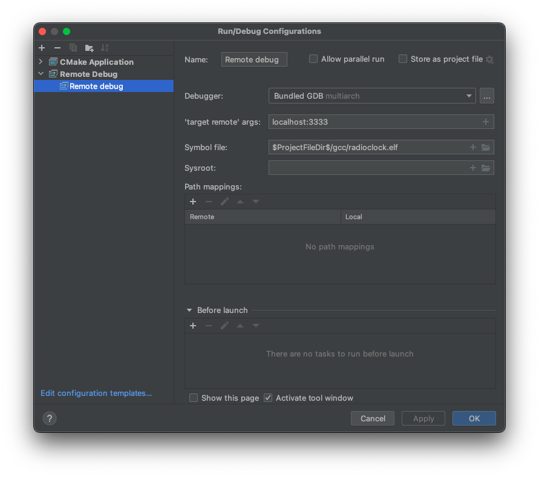
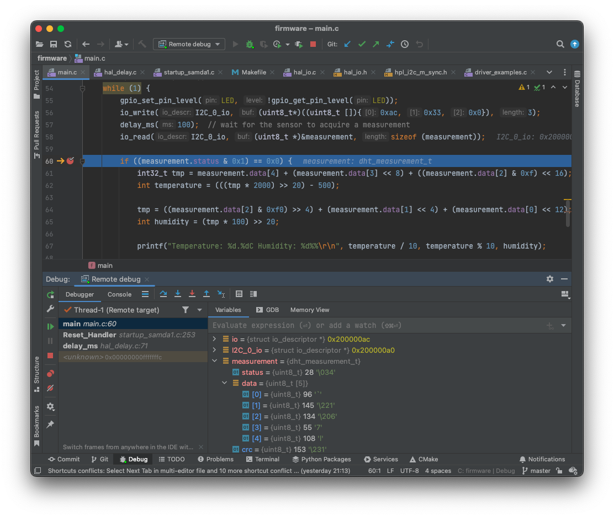

# Firmware

This directory contains the firmware for the radio-controlled clock.

## Requirements

* ARM-GCC toolchain
* [OpenOCD](https://openocd.org/)
* SWD programmer device (e.g. [Atmel-ICE](https://www.microchip.com/en-us/development-tool/ATATMEL-ICE))

On Mac, install the GCC ARM toolchain and OpenOCD through [Homebrew](https://brew.sh/):

```shell
$ brew install --cask gcc-arm-embedded
$ brew install open-ocd
```


## Compiling

```shell
$ cd firmware/gcc/
firmware/gcc $ make
Building file: ../hal/src/hal_io.c -> hal/src/hal_io.o
ARM/GNU C Compiler
[...]
Finished building target: radioclock.elf
"arm-none-eabi-objcopy" -O binary "radioclock.elf" "radioclock.bin"
"arm-none-eabi-objcopy" -O ihex -R .eeprom -R .fuse -R .lock -R .signature  \
        "radioclock.elf" "radioclock.hex"
"arm-none-eabi-objcopy" -j .eeprom --set-section-flags=.eeprom=alloc,load --change-section-lma \
        .eeprom=0 --no-change-warnings -O binary "radioclock.elf" \
        "radioclock.eep" || exit 0
"arm-none-eabi-objdump" -h -S "radioclock.elf" > "radioclock.lss"
"arm-none-eabi-size" "radioclock.elf"
   text	   data	    bss	    dec	    hex	filename
  10432	    100	   2148	  12680	   3188	radioclock.elf
firmware/gcc $
```


## Flashing

Connect the Atmel-ICE programmer to the board and power up the board, then run `make program` from `firmware/gcc`:

```shell
firmware/gcc $ make program
Writing flash...
openocd -f ../openocd.cfg -c "program radioclock.elf verify reset exit"
Open On-Chip Debugger 0.11.0
Licensed under GNU GPL v2
For bug reports, read
	http://openocd.org/doc/doxygen/bugs.html
DEPRECATED! use 'adapter driver' not 'interface'
Info : CMSIS-DAP: SWD  Supported
Info : CMSIS-DAP: JTAG Supported
Info : CMSIS-DAP: FW Version = 1.0
Info : CMSIS-DAP: Serial# = J42700010829
Info : CMSIS-DAP: Interface Initialised (SWD)
Info : SWCLK/TCK = 1 SWDIO/TMS = 1 TDI = 1 TDO = 1 nTRST = 0 nRESET = 1
Info : CMSIS-DAP: Interface ready
Info : clock speed 400 kHz
Info : SWD DPIDR 0x0bc11477
Info : at91samda1e16b.cpu: hardware has 4 breakpoints, 2 watchpoints
Info : starting gdb server for at91samda1e16b.cpu on 3333
Info : Listening on port 3333 for gdb connections
target halted due to debug-request, current mode: Thread
xPSR: 0x41000000 pc: 0x000010c4 msp: 0x200008c8
** Programming Started **
Info : SAMD MCU: SAMDA1E16B (64KB Flash, 8KB RAM)
** Programming Finished **
** Verify Started **
** Verified OK **
** Resetting Target **
shutdown command invoked
firmware/gcc $
```


## On-Chip Debugging in CLion

Interactive, on-chip debugging is supported though OpenOCD's built-in gdbserver.

After compiling and flashing the current firmware onto the board, run `make debug` in a terminal:

```shell
firmware/gcc $ make debug
Starting OpenOCD debug server...
openocd -f ../openocd.cfg -c "init; reset halt"
Open On-Chip Debugger 0.11.0
Licensed under GNU GPL v2
For bug reports, read
	http://openocd.org/doc/doxygen/bugs.html
DEPRECATED! use 'adapter driver' not 'interface'
Info : CMSIS-DAP: SWD  Supported
Info : CMSIS-DAP: JTAG Supported
Info : CMSIS-DAP: FW Version = 1.0
Info : CMSIS-DAP: Serial# = J42700010829
Info : CMSIS-DAP: Interface Initialised (SWD)
Info : SWCLK/TCK = 1 SWDIO/TMS = 1 TDI = 1 TDO = 1 nTRST = 0 nRESET = 1
Info : CMSIS-DAP: Interface ready
Info : clock speed 400 kHz
Info : SWD DPIDR 0x0bc11477
Info : at91samda1e16b.cpu: hardware has 4 breakpoints, 2 watchpoints
Info : starting gdb server for at91samda1e16b.cpu on 3333
Info : Listening on port 3333 for gdb connections
target halted due to debug-request, current mode: Thread 
xPSR: 0x41000000 pc: 0x000019e4 msp: 0x20000900
Info : Listening on port 6666 for tcl connections
Info : Listening on port 4444 for telnet connections
Connect CLion Remote Debug session now...
```

Leave this process running while debugging. Kill it before flashing new
firmware, as only one OpenOCD server can be connected to the target at a time.

Now open the `firmware/` directory as project root in
[CLion](https://www.jetbrains.com/clion/) and create a "Remote Debug" session
as per:
https://www.jetbrains.com/help/clion/remote-debug.html#start-remote-debug



Then run the session and CLion will connect to the OpenOCD daemon running in
the other terminal and attach to the running firmware:


